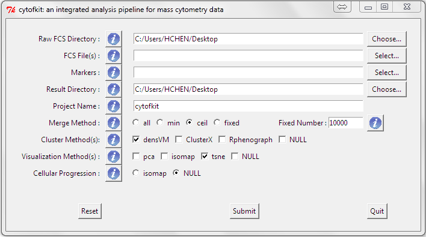
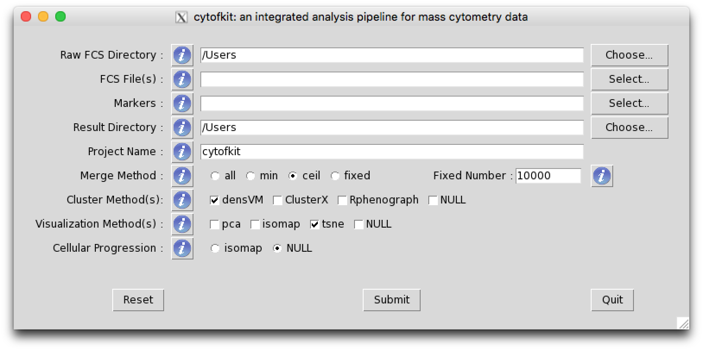

<!--
  %\VignetteIndexEntry{cytofkit: run with an example}
  %\VignetteEngine{knitr::knitr}
-->


Cytofkit: Quick Start
====================================================


(NOTE: *remove the hash symbols (#) to run the codes on your machine*)

Install the Package
----------------------
To install this package, start R and enter:
```{r}
#source("https://bioconductor.org/biocLite.R")
#biocLite("cytofkit")
```

Load the Package
--------------------

```{r, message=FALSE}
#library("cytofkit") 
```

Open the package help page to take a first look of the pakcage:
```{r, results='hide'}
#?cytofkit-package
```

Options for Using the Package
------------------------------

**Cytofkit** provides three ways to employ the workforce of this package:

1. [GUI with function](#gui)
2. [The core function](#core)
3. [Step-by-step](#step) 

### 1. Run With GUI {#gui}

**Cytofkit** provides a user friendly GUI to access full options of **cytofkit** package. To launch the GUI, load the package and type the following command:
```{r}
# cytofkit_GUI()  ## remove the hash symbol to launch the GUI
```

The interface will appear like below, you can click the information button `!` to check the information for each entry and customize your own analysis.

On Windows:    



On Mac:   


               

### 2. Run With Core Function {#core}

**Cytofkit** provides a core function `cytofkit()` to facilitate the analysis pipeline of mass cytometry data. Users only need to define several key parameters to make their analysis automatically. One simple example of running cytofkit using the core function is like this:
```{r, eval=FALSE}
#dir <- system.file('extdata',package='cytofkit')
#file <- list.files(dir ,pattern='.fcs$', full=TRUE)
#parameters <- list.files(dir, pattern='.txt$', full=TRUE)
# cytofkit(fcsFile = file, markers = parameters, projectName = 'test')  
```

You can also define more parameters to customize your own analysis, please check the help page of `cytofkit()` to get more information of the parameters.
```{r, results='hide'}
#?cytofkit
```
             

### 3. Run With Commands (Step-by-step) {#step}

Due to the usually big size of the fcs data, we just use one small size file here as a demo, you can easily expand the analysis to multiple .fcs files.


                        

