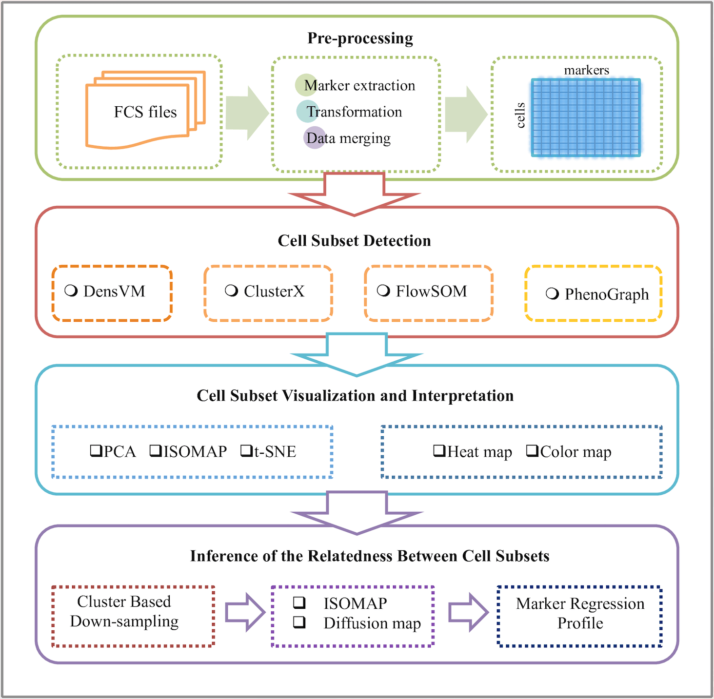

<!--
  %\VignetteIndexEntry{cytofkit: workflow of mass cytometry data analysis}
  %\VignetteEngine{knitr::knitr}
-->


Cytofkit: Integrated Mass Cytometry Data Analysis Pipeline
==============================================================
             
             
Introduction
-------------

The **cytofkit** package is designed to facilitate the analysis of mass cytometry data 
with with multiple .FCS files: user can customize their data merging strategy to combine
the data with an optimized logicle transformation; apply state-of-the-art clustering 
methods like DensVM [1] and PhenoGraph [2] as well as a in-house developed algorithm 
ClusterX to automatically detect cell subsets; visualize the high-dimensional data with 
color labeled cell types by either linear transformation like PCA or non-linear 
dimensionality reduction like ISOMAP or t-SNE; map the progression of cellular subtypes 
estimated by ISOMAP and profile the marker expression along the cell progression. In 
addition to providing the research community with a one-stop analysis platform, Cytofkit
is shipped together with an intuitively designed GUI and an interactive web app to 
facilitate the easy analysis and interpretation of the mass Cytometry data. 
                   
                   
Start Guide
------------

The most simple way to use the **cytofkit** package is to either use the GUI or the
core function. Both provide almost all the options for this CyToF analysis pipeline. Start 
the GUI with a simple command `cytofkit_GUI()`, you will find all the options there on 
the GUI, click the `!` buttion to get the explanation of each parameter. Launching one 
analysis simply like this: Choose the input fcs files from the directory where you 
store the data; select the markers from the auto-generated marker list; choose the 
directory to save the output; give a project name as a prefix of the names of result 
files; select a merging method if you have multiple files, choose your clustering 
method, visualization method, progression estimation method, then you can submit your 
analysis. Depends on the size of your data, it will take some time to run the analysis.
Once it's done, all the results will be saved under you result directory. The core 
function has these parameters in a command way, you can define these inputs as in the 
GUI using the parameters of the function `cytofkit`, check the help page `?cytofkit` to
check the information of the parameters.

The GUI and the core function are all you need if you want to make use of the **cytofkit** package
easily. For deep customizing the analysis, **cytofkit** package also provides a step-by-step guide
for the analysis pipeline. To view details, start R and enter: `browseVignettes("cytofkit")`

           
Cytofkit Analysis Pipline
--------------------------

A schematic overview of the pipeline is as below, it contains four major components: (1) 
pre-processing, (2) cell subset detection, (3) cell subset visualization and interpretation and 
(4) Inference of subset progression. 


               

### Pre-processing

One or multiple .FCS files produced by the cytometer are imported into the R environment via the 
read.FCS function in the flowCore package. Intensity values of marker expression were then 
transformed with an optimized logicle transformation, then user selected m markers were extracted 
and expression matrixes from multiple files were combined into a single matrix. For multiple .FCS 
files, cytofkit provides four data combining methods including i) ceil which samples up to a user 
specified number of cells without replacement from each .FCS file then combine, ii) all which 
takes all cells from each fcs file then combine, iii) min which samples minimum number of cells 
among all the selected .FCS files from each .FCS file then combine and iv) fixed which samples an 
user specified number of cells (with replacement when the total number of cell in the file is less
than the specified number) from each .FCS file then combine. After combination, the whole dataset 
is represented as a matrix of m dimensions, where each dimension records the expression of a 
particular protein for all cells. Cells from different files are identified by unique row names 
containing the sample name and it???s sequence ID in the file. Check the function `cytof_exprsMerge`
for implementation of this step.

```{r, results='hide'}
?cytof_exprsMerge
```


### Cell subset detection

The subset detection is implemented by clustering algorithms. Cytofkit ships with two 
state-of-the-art clustering methods DensVM and PhenoGraph and an in-house developed clustering 
algorithm clusterX. Among them, DensVM and clusterX are density-based clustering algorithms 
estimated from the t-SNE embedded map. While PhenoGraph is a graph based clustering algorithm 
performed directly on the high-dimensional data. DensVM and PhenoGraph are existing algorithms and
are already detailed explained in corresponding papers. So here we just briefly introduce them. 
ClusterX as a new developed algorithm for fast density based clustering will be explicitly 
explained in our paper which will be published soon. Check the function `cytof_cluster` for 
implementation of this step.

```{r, results='hide'}
?cytof_cluster
```

  
### Cell subset Visualization and Interpretation 

Three dimensionality reduction methods are integrated into Cytofkit for visualizing the high 
dimensional mass cytometry data into an information-condensed and relationship-preserved 
two-dimensional map. These included one linear transformation method PCA and two non-linear 
transformation methods ISOMAP and t-SNE. PCA is a commonly used technique to remove the linear 
correlation between variables. After PCA, data is represented by principal components, and those 
two or three principal components with highest variance are used to visualize the data. ISOMAP is 
used to embed the high-dimensional data points into low dimensions while preserving the intrinsic 
geometry of the data structure. T-SNE finds the two-dimensional representation of high-dimensional
data that best preserves both local and global geometry. After dimensional reduction, cytofkit 
plots the cell points into these transformed two-dimensional map with point color representing its
cell type detected from last step, and point shape representing which sample the cell is from. To 
summarize the expression profile of each cell subset, a heat map can be generated to visualize the
mean or median expression for each marker in each cell type. This heat map can greatly facilitate 
the interpretation of known cell types with prior knowledge of their special marker expression 
features as well as detection of new cell types with novel expression patterns. Check the function
`cytof_dimReduction` for implementation of this step.

```{r, results='hide'}
?cytof_dimReduction
```


### Inference of Subset Progression

Instead of inferring the subset progression using all cells, we perform the progression path 
estimation based on the detected subsets of cells.  Specifically, we down sample the number of 
cells to a fixed number for each cell subset, thus to make every subset has the equal number of 
cells. This removes the potential dominance influence from cell subtypes with majority number of 
cells. Then ISOMAP is used to infer the relationships among the down sampled subsets. ISOMAP is 
able to compare overall relatedness of cells and embed the cells taking into account the nonlinear
geodesic distances between cells. Using the score of ISOMAP dimension 1 and dimension 2, a minimal
spanning tree connecting the center of subsets is constructed to capture the subset progression 
paths. By plotting the marker expression along the ISOMAP dimension 1 or dimension 2 with lowess 
regression, markers with expression pattern that highly correlated with progression can be defined
as regulatory markers. Check the function `cytof_progression` for implementation of this step.

```{r, results='hide'}
?cytof_progression
```


### Post-processing

The cluster results can be visualized with dimension transformed data from "tsne", "pca" and 
"isomap". The cluster coordinates, together with the t-SNE, PCA and ISOMAP coordinates, were added
to the .FCS files as additional parameters and saved for post analysis, all intermediate files and
the plots can be saved using the function `cytof_writeResults`.

```{r, results='hide'}
?cytof_writeResults
```

             
References
--------------

[1] Becher B, Schlitzer A, Chen J, Mair F, Sumatoh HR, Wei K, et al. High-dimensional analysis of 
the murine myeloid cell system. Nat Immunol. 2014;15. doi:10.1038/ni.3006.nature

[2] Levine JH, Simonds EF, Bendall SC, Davis KL, Amir ED, Tadmor MD, et al. Data-Driven Phenotypic
Dissection of AML Reveals Progenitor-like Cells that Correlate with Prognosis. Cell. Elsevier 
Inc.; 2015; 1???14. doi:10.1016/j.cell.2015.05.047
